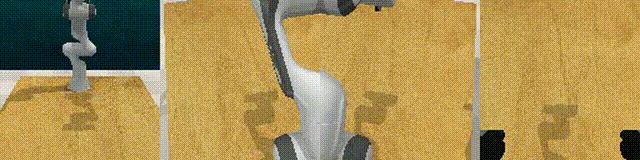
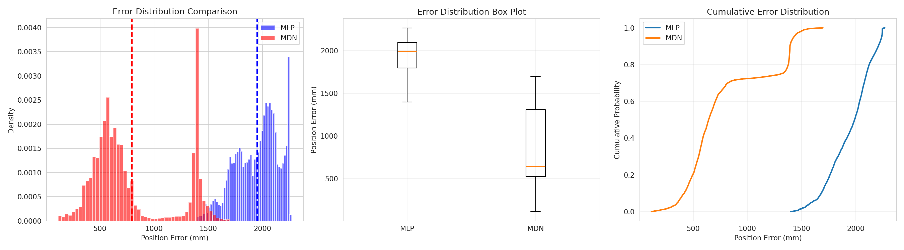
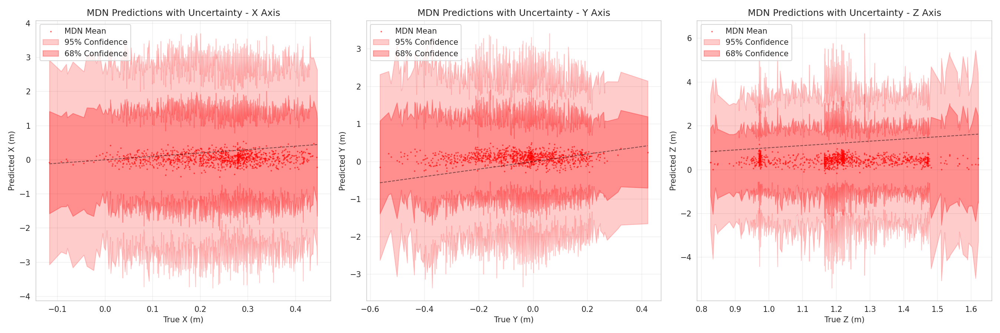

# Mixture Density Network for Robot Forward Kinematics

A PyTorch implementation of Mixture Density Networks (MDN) and standard Multi-Layer Perceptrons (MLP) for learning forward kinematics of robotic manipulators. This project demonstrates how MDNs can model the inherent uncertainty in robotic systems by learning probability distributions over end-effector positions rather than point estimates.


## Table of Contents

- [Installation](#installation)
- [Project Structure](#project-structure)
- [Usage](#usage)
  - [Data Collection](#data-collection)
  - [Training](#training)
  - [Testing and Evaluation](#testing-and-evaluation)
- [Results](#results)


## Installation

### Step 1: Clone the Repository

```bash
git clone https://github.com/yourusername/mixture-density-network.git
cd mixture-density-network
```

### Step 2: Create Virtual Environment

```bash
# Using conda
conda create -n mdn python=3.8
conda activate mdn
```

### Step 3: Install Dependencies

```bash
pip install -r requirements.txt
```

### Step 4: Install RLBench

```bash
# Follow RLBench installation instructions
https://github.com/stepjam/RLBench?tab=readme-ov-file#install
```

## Project Structure

    mixture-density-network/
    │
    ├── config/
    │   ├── mlp.yaml              # MLP model configuration
    │   └── mdn.yaml              # MDN model configuration
    │
    ├── data/
    │   ├── create_dataset.py     # Dataset generation from RLBench
    │   ├── dataloader.py         # PyTorch dataset and dataloader
    │   └── rlbench_kinematics_dataset/
    │       ├── train/            # Training data
    │       └── validation/       # Validation/test data
    │
    ├── models/
    │   ├── mlp.py                # MLP implementation
    │   └── mdn.py                # MDN implementation
    │
    ├── checkpoints/              # Saved model weights
    │   ├── mlp/
    │   │   ├── best_model.pth
    │   │   └── training_curves.png
    │   └── mdn/
    │       ├── best_model.pth
    │       └── training_curves.png
    │
    ├── results/                  # Test results and visualizations
    │   ├── error_comparison.png
    │   ├── axis_predictions.png
    │   ├── mdn_uncertainty_bands.png
    │   ├── uncertainty_analysis.png
    │   └── performance_table.png
    │
    ├── train.py                  # Training script
    ├── test.py                   # Testing and comparison script
    ├── requirements.txt          # Project dependencies
    └── README.md                 # This file

## Usage

### Data Collection

If you don't have a dataset, generate one from RLBench:

```bash
python -m data.create_dataset --episodes 1000 --timesteps 100
```

This will create training and validation datasets with robot kinematics data.

### Training

#### Train MLP Model

```bash
python train.py --model mlp
```

#### Train MDN Model

```bash
python train.py --model mdn
```

#### Custom Configuration

```bash
python train.py --model mdn --config path/to/custom_config.yaml
```

Training will:
- Save checkpoints to `checkpoints/{model_name}/`
- Generate training curves
- Save training history in JSON format
- Display real-time training progress

### Testing and Evaluation

Compare both models on the test set:

```bash
python test.py
```

This will:
- Load both trained models
- Evaluate on the validation/test set
- Generate comprehensive comparison visualizations
- Display performance metrics
- Create uncertainty visualizations for MDN


## Results

### Error Distribution Comparison



*Comparison of prediction errors between MLP and MDN models, with error histograms, box plots, and cumulative distributions.*

### MDN Uncertainty Visualization



*MDN predictions with 68% and 95% confidence intervals*

### Performance Summary

| Metric       | MLP           | MDN           |
|-------------:|--------------:|--------------:|
| Mean Error   | 1951.67 mm    | 795.43 mm     |
| Std Error    | 197.43 mm     | 387.01 mm     |
| Median Error | 1990.20 mm    | 641.58 mm     |
| Max Error    | 2269.51 mm    | 1698.03 mm    |
| 95th %ile    | 2240.32 mm    | 1428.55 mm    |
| 99th %ile    | 2246.43 mm    | 1529.63 mm    |

#### MLP Performance

MLP shows higher mean and median errors and larger worst-case errors compared to MDN.

#### MDN Performance

MDN typically achieves better accuracy and provides uncertainty estimates that help interpret predictions.